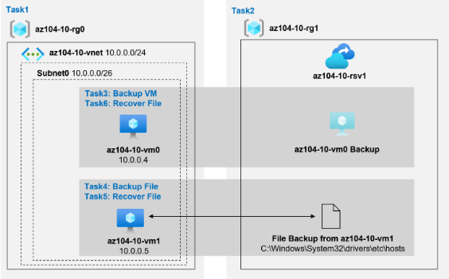

# Copia de seguridad de máquinas virtuales

Evaluaremos el uso de Azure Recovery Services para realizar copias de seguridad y restaurar archivos alojados en máquinas virtuales de Azure y equipos locales. Además, desea identificar métodos para proteger los datos almacenados en el almacén de Recovery Services contra pérdidas de datos accidentales o maliciosas.

## Objetivos

En este laboratorio, realizaremos:

- Tarea 1: Aprovisionar el entorno de laboratorio

- Tarea 2: crear un almacén de servicios de recuperación

- Tarea 3: implementar una copia de seguridad a nivel de máquina virtual de Azure

- Tarea 4: Implementar la copia de seguridad de archivos y carpetas

- Tarea 5: realizar la recuperación de archivos mediante el agente de Azure Recovery Services

- Tarea 6: realizar la recuperación de archivos mediante instantáneas de máquinas virtuales de Azure 

- Tarea 7: revisar la funcionalidad de eliminación temporal de Azure Recovery Services 

  

## Diagrama de arquitectura

